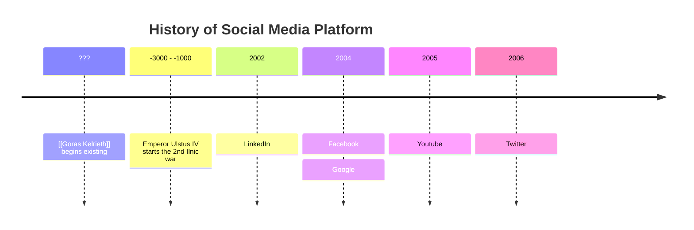

??? | ??? - Goras Kelrieth begins existing  
-3,000 |  
       | -2,289 - Emperor Ulstus IV starts the 2nd Ilnic war  
-2,000 |  
-1,500 |  
-1,250 |  
-1,100 |  
-1,050 |  
-1,040 |  
-1,030 |  
       | -1029/01/24 - Elkwood is settled   
-1,020 |
-1,010 |
-1,000 |
  -500 |
  -250 |
   000 |  
       | 000/03/23 - The Datrus Empire is founded  
   010 |
   020 |
   030 |
   040 |
   050 |  
       | 050/07/13 - The Datrus Civil War begins
   060 |  
       | 065/08/28 - The Datrus Civil War ends
   070 |
   080 |
   090 |
   100 |
   110 |
   120 |
   130 |
   140 |
   150 |
   160 |
   170 |
   180 |
   190 |
   200 |
   210 |
   220 |
   230 |
   240 |
   250 |
   260 |
   270 |
   280 |
   290 |
   300 |
   310 |
   320 |
   330 |
   340 |
   350 |
   360 |
   370 |
   380 |
   390 |
   400 |
   410 |
   420 |
   430 |  
       | 432/04/01 - The Swift Earth Tribe is wiped off the map  
   440 |
   450 |
   460 |  
       | 
   470 |
   480 |  
       | 487 - Torveldus is formed
   490 |
   500 |
   510 |
   520 |  
       | 527 - Tittlin is born  
   530 |
   540 |  
   550 |
   560 |
   570 |
   580 |  
       | 584 - Admiral Clay Walsh is born  
   590 |
   600 |  
       | 602 - Emmanuel Foster is born  
   610 |
   620 |  
       | 622 - Eldon Porridgepot is born  
       | 623 - Foster joins the Quickfield Caravan  
   630 |  
       | 635 - Eldon joins the caravan
   640 |
   650 |
   660 |  
       | 660 - The Battle of Wapeboro Deep claims Clay Walsh's life  
       | 666 - Spesof Beegstick is born  
       | 668 - Johanna (JoJo) is born  
       | 669 - Grustelin Steelmaker is born  
   670 |  
       | 671/07/14 - The Datrus/Torveldus war begins  
       | 671/09/18 - Merric Porridgepot is born  
   680 |  
       | 681 - Spesof washes ashore  
       | 682 - Gwendolen Porridgepot is born  
       | 684 - The Datrus/Torveldus war ends in a stalemate  
       | 685 - Eldon is killed  
       |     - Johanna recieves a revelation and begins her journey  
       |     - Jessamine Porridgepot is hauled off to a torveldan prison  
       |     - Emmanuel Foster leaves the caravan group  
   690 |  
       | 692 - Merric adopts Gwen  
       | 695 - Merric's Aunt Jillian dies (age 81)  
       |     - Merric discovers 5013 in the forest  
       |     - Merric forms The Cedar Combe Monster Bashers  
       |     - Spesof joins the CCMB  
       |     - Johanna joins the CCMB  
       | 696 - Emmanuel Foster dies (age 94)  
       |     - Tittlin is robbed and joins the CCMB  
       |     - THE ADVENTURE BEGINS  
       | 696/10/01 - Tittlin retrieves Pisces  
       |           - The CCMB thwarts an attempted assassination of Geoff Reinhardt  
       |           - Tittlin Assassinates Gunnarr Olafson  
   700 |