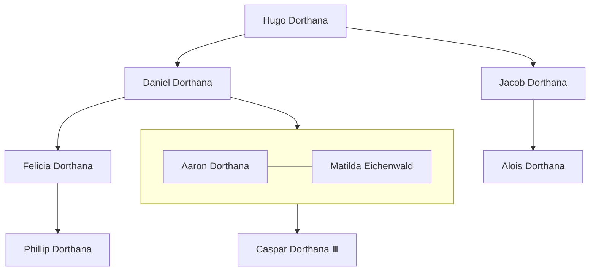

---
tags:
  - People
  - Noble
location:
  - "[[The Empire of Datrus]]"
  - "[[The Great Badger Expanse]]"
  - "[[Stormcairn]]"
race: Human
rank: Count
born: "656"
died:
---

- Count of Stormcairn
- [[Burnidu Diltheth]] tried to kill him, by stealing [[Doctor Bramblepelt]], the poison detecting tressym
- indiscretion with [[Matilda Eichenwald]] during his induction party led to [[Caspar Dorthana Ⅲ]]'s birth
- Pact of silence
- strong swordfighter
- Held a very eventful wedding