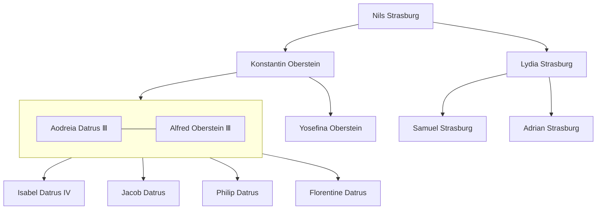

---
tags:
  - Noble
  - People
location:
  - "[[The Empire of Datrus]]"
  - "[[The Imperial Plains]]"
  - "[[Elkenalden]]"
race: Human
rank: King
born: "670"
---

King Alfred Ⅲ is a calm, caring man - an excellent foil to Aodreia's wrath. He is king-consort by way of his marriage to [[Aodreia Datrus Ⅲ]]. He is Duke of [[The Imperial Plains]] by his own rights though he was born in [[Tunris Valley]]. As the Duke he is the ruler of [[Coltoise]] but is rarely, if ever, found there. At any given time he is most likely found right beside his wife.

His personality often makes him the butt of emasculating jokes, but they never go very far for two reasons:

1. Despite his demeanor, he has had no challenge coaxing heirs out of the romantically disinclined Aodreia
2. Most people know that anyone would look weak next to Aodreia

# Relationship with Aodreia
He's been infatuated with Aodreia since he was a child, and is considered the only man alive with a chance in hell of continuing the royal line. In that regard, it seems his tenure has been quite successful.

He has sired 4 princes/princesses:

1. [[Isabel Datrus IV]] - the crown princess
2. Jacob
3. Philip
4. Florentine

Aodreia named their first child, Alfred named the other three.
# Role as Aphrodite's Archpontiff

- Performs noble weddings for those who cannot afford their own
# Plan to Defeat the Lord of Ice