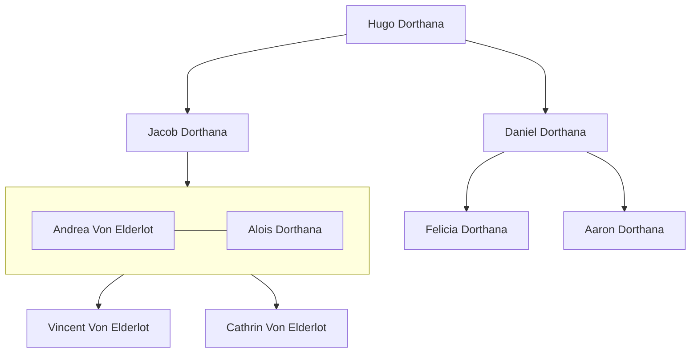

---
tags:
  - People
  - Noble
location:
  - "[[The Empire of Datrus]]"
  - "[[The Great Badger Expanse]]"
  - "[[Elderlot]]"
race: Human
rank: Baronet
born: "662"
died:
---

```mermaid
flowchart TB

I["Jacob Dorthana"] --> F
subgraph F [" "]
	direction RL
	G["Alois Dorthana"] --- J["Andrea Von Elderlot"]
	end
F --> A["Vincent Von Elderlot"]
F --> B["Cathrin Von Elderlot"]
C["Daniel Dorthana"] --> D["Felicia Dorthana"]
C --> E["Aaron Dorthana"]
H["Hugo Dorthana"] ---> C
H ---> I
class I,D,E,F,J internal-link;
class G current-person;
```

