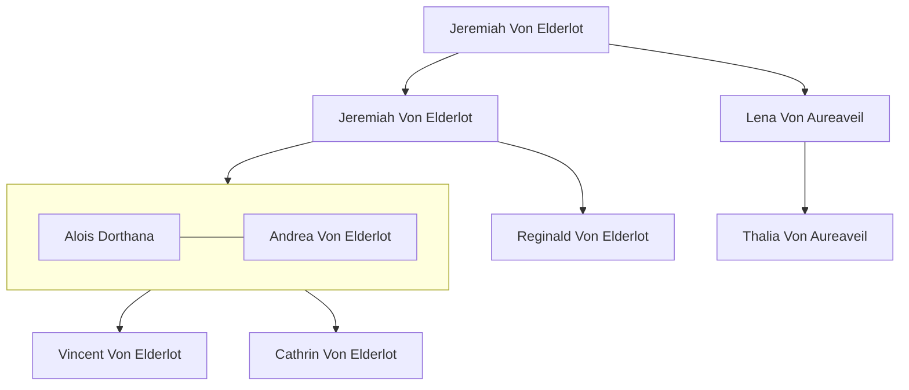

---
tags:
  - People
  - Noble
location:
  - "[[The Empire of Datrus]]"
  - "[[The Great Badger Expanse]]"
  - "[[Elderlot]]"
race: Human
rank: Baroness
born: "667"
died:
---

```mermaid
flowchart TB

A["Jeremiah Von Elderlot"] --> B
subgraph B [" "]
	direction LR
	E["Alois Dorthana"] --- F["Andrea Von Elderlot"]
	end
B --> C["Vincent Von Elderlot"]
B --> D["Cathrin Von Elderlot"]
A["Jeremiah Von Elderlot"] --> G["Reginald Von Elderlot"]
H["Jeremiah Von Elderlot"] --> A
H --> I["Lena Von Aureaveil"]
I --> J["Thalia Von Aureaveil"]
class E,G,J internal-link;
class F current-person;
```

