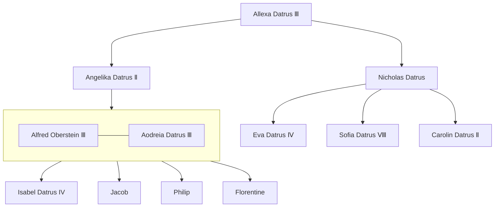

---
tags:
  - Noble
  - People
location:
  - "[[The Empire of Datrus]]"
  - "[[The Imperial Plains]]"
  - "[[Elkenalden]]"
race: Human
rank: Empress
born: "668"
died:
---

The current Empress of [[The Empire of Datrus|Datrus]]. She is renowned for both her beauty and brutality. She holds the reigns of power in a tight grip and has little compassion for those who fail to do their jobs. She ascended to the throne at only twelve years old after her mother, [[Angelika Datrus Ⅱ]], died during the [[Datrian-Torveldan War]].

She is an experienced politician, stateswoman, and military commander, known to strike fear into the hearts of anyone who approaches her.

She brought the [[Kingdom of Dirith]] and [[The Great Badger Expanse]] into Datrus, making Datrus an empire.

She is married to [[Alfred Oberstein Ⅲ]] and reigns over [[Elkenalden]], the capital of Datrus.

[[Isabel Datrus IV]]
