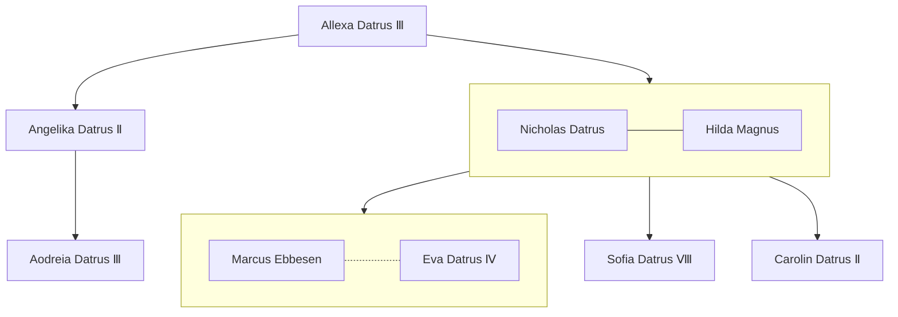

---
tags:
  - Noble
  - People
location:
  - "[[The Empire of Datrus]]"
  - "[[The Great Badger Expanse]]"
  - "[[Galegulch]]"
race: Human
rank: Countess
born: "680"
died:
---

[[Nicholas Datrus|Prince Nicholas']] eldest daughter. Much like her father, she is a ruthless opportunist. Eva and her sisters are the current [[Aodreia Datrus Ⅲ|Empress']] only first cousins - a position of much political power, but she lacks practical power to back it up. As such, she is actively hunting for a man of means (either wealth or man-power) to take as her husband.