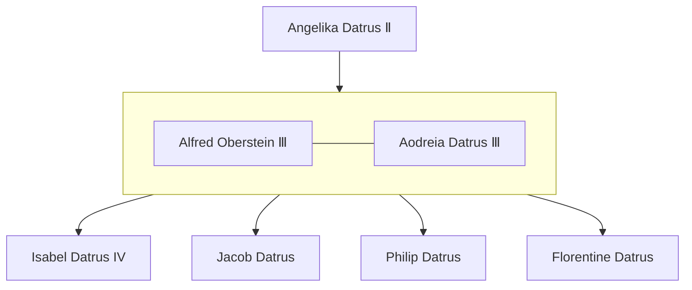

---
tags:
  - People
location:
  - "[[The Empire of Datrus]]"
  - "[[The Imperial Plains]]"
  - "[[Elkenalden]]"
race: Human
rank: Princess
born: "686"
died:
---

Named after [[Isabel Datrus Ⅱ ― Child Conqueror]]
