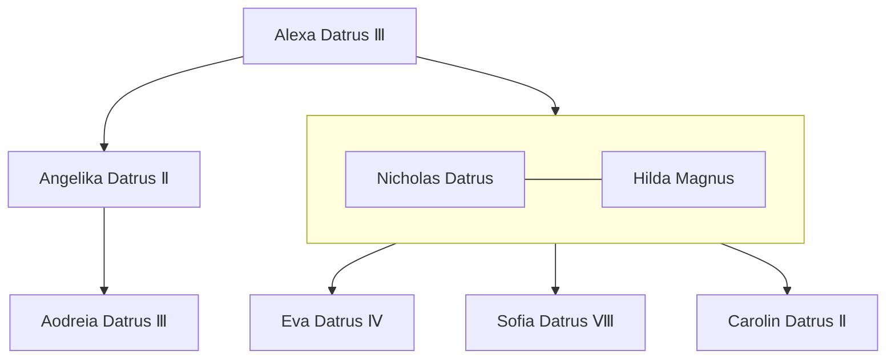

---
tags:
  - Noble
  - People
location:
  - "[[The Empire of Datrus]]"
  - "[[The Great Badger Expanse]]"
  - "[[Redlock]]"
race: Human
rank: Prince
born: "659"
died:
---

[[Aodreia Datrus Ⅲ|Empress Aodreia]]'s uncle. The man in charge of [[The Great Badger Expanse]]. Despite being the Datrian vanguard against [[The Kingdom of Torveldus]] during the [[Datrian-Torveldan War]], he spends most of his days holed up in [[Redlock]] instead of [[Cedar Combe]] where he is supposed to be. Overshadowed by his niece, the prince is known as a power-hungry coward.

Following [[Angelika Datrus Ⅱ]]'s death, Nicholas was acting regent for 5 months, before he was wounded in the [[The First Battle of Elkmire Keep|Battle of Elkmire Keep]] and fell into a coma, making Aodreia III the regent despite only being 12.

He was attempting to starve out the keep, but Merric's father smuggled supplies into the fortress.

[[Eva Datrus Ⅳ]] [[Sofia Datrus Ⅷ]][[Carolin Datrus Ⅱ]]
