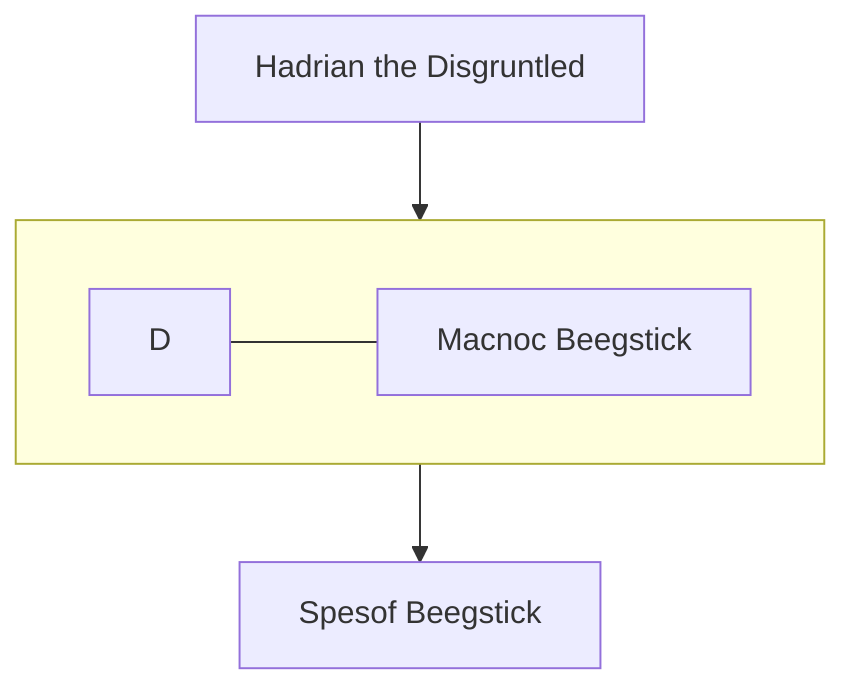

---
tags:
  - People
location:
  - "[[The Empire of Datrus]]"
  - "[[Spueria]]"
race: Half-Orc
born: "666"
died:
---

Spesof is from Spueria.

Born on a boat, Spesof was raised by a single father who was a travelling merchant. 

He was too young to remember what happened to his mother, and his father never told him.

As a teenager, while sailing between towns, Spesof and his father got caught in a wicked storm.

Spesof was launched overboard by the waves - Spesof miraculously washed up ashore, but his father and the boat were nowhere to be found when he awoke. After that, Spesof greatly feared the sea and tries to stay as far away from it as possible. 

He took to chopping down trees as an outlet for his anger, which also landed him lumbering jobs periodically.

Despite being afraid of the sea, he still had his father's sense of adventure and continued to travel, never staying in the same place for too long. He never became close with anyone because of his constant travelling. After many years of travelling and a lack of companionship, he came upon Cedar Combe while searching for more lumbering work.

Merric's establishment was one of the first spots he stopped at in town. 

Being a burly half-orc carrying a large axe, Spesof immediately caught Merric's attention upon entering the tavern.

Spesof was looking for work, and Merric had work to offer - Spesof welcomed the change of pace from chopping down trees by his lonesome. For the first time in his life, Spesof feels like he has other people that he can rely on, and that he might consider his friends - his anger is now directed towards anyone who might try to take that away from him.